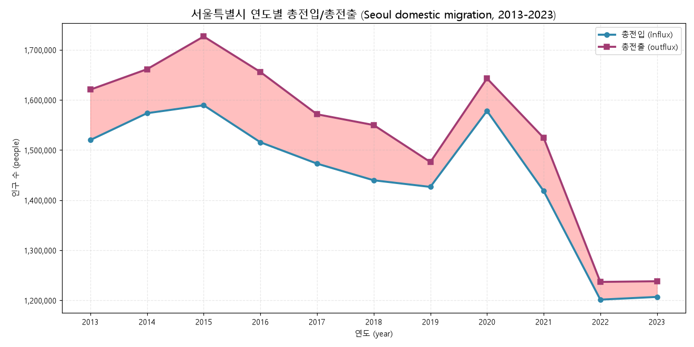
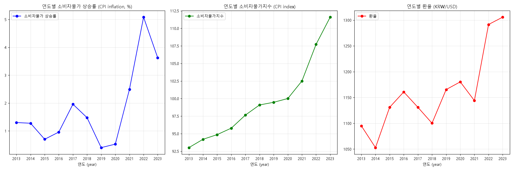

# Seoul Real Estate Market Analysis

A data collection, integration, and visualization project (completed August 2024): scrapes Seoul property listings from the Zigbang real-estate API, merges them with 11 years of Korean macroeconomic indicators and Seoul open data, and turns the result into matplotlib charts and interactive Folium maps.

[](https://www.python.org/)
[](https://pandas.pydata.org/)
[](https://python-visualization.github.io/folium/)

## Results at a glance

All numbers below are verifiable from files committed in this repository (row counts via `pandas.read_excel`, ID ranges from the scraper source, insights from the committed datasets and checked-in notebook outputs).

| Result | Number | Evidence in repo |
| --- | --- | --- |
| Listing/transaction rows collected and committed | **123,570** across 8 scraped datasets | `data/seoul_oneroom_*.xlsx`, `data/서울시_아파트_*.xlsx`, `data/서울시_상가_*.xlsx` |
| Zigbang API IDs polled during collection | **177,794** across 4 endpoints | ID ranges in `src/data_collection/project ex*.py` |
| Datasets integrated (macro + city + listings) | **45 Excel files, 34 MB**, 2013–2023 | `data/` |
| Headline insight: Seoul lost residents to domestic migration **every year 2013–2023** | cumulative net **−961,881** people | computed from `data/서울시_인구이동.xlsx` |
| Top district by apartment-sale listings | 은평구 Eunpyeong-gu (**403**), then 강서구 388, 강남구 351 | checked-in output of `notebooks/서울시 아파트 매매.ipynb` |



*Seoul in/out domestic migration, rendered from `data/서울시_인구이동.xlsx` (the shaded band is the yearly net loss).*

## Quick start

Clone the repository and install the dependencies:

```bash
git clone https://github.com/CY-HYUN/Korean-Real-Estate-Project.git
cd Korean-Real-Estate-Project

# minimal set actually needed by the analysis/visualization scripts (verified):
pip install pandas openpyxl requests matplotlib folium
# or the full stack (adds jupyter, seaborn, plotly, geopandas, scipy, statsmodels):
pip install -r requirements.txt
```

Run any analysis or visualization script directly (verified end-to-end on a fresh environment):

```bash
python "src/visualization/GDP 금리 물가.py"    # 3-panel chart: CPI inflation, CPI index, KRW/USD
python "src/analysis/서울시_인구이동.py"        # Seoul in/out migration analysis
jupyter notebook notebooks/                    # Folium choropleth maps + preprocessing walkthrough
```

**Data notes (honest):**

- Every dataset is committed in `data/` (45 Excel files, 34 MB) — nothing external is needed to inspect the data.
- The analysis/visualization scripts download identical copies from the project's GitHub data mirror (`raw.githubusercontent.com/aaqq8/SteadyEstate`), so they run from any clone without path edits. Internet is required; the mirror was verified live as of 2026-07.
- Chart labels are Korean. On a machine without a Korean matplotlib font they render as boxes — add `plt.rcParams['font.family'] = 'Malgun Gothic'` (Windows) or another CJK font first.
- The scrapers in `src/data_collection/` are the archival record of the August 2024 collection run. They hit the live Zigbang API and write to hardcoded paths from the original machine — edit the output paths before re-running them.

## What was built

```text
Zigbang API (4 endpoints, 177,794 IDs polled)
        │  src/data_collection/project ex.py, ex1.py, ex2.py, ex3.py
        ▼
Flatten nested transaction JSON (1 listing → N transaction rows)
        │  project file.py / ex4.py
        ▼
Enrich + filter: subway-adjacency flag → Seoul-only → split by sales type
        │  ex5.py → ex6.py → ex7.py  (ex8.py: reverse geocoding)
        ▼
Committed datasets (data/*.xlsx, 123,570 rows)
        +
Macro & city data: Bank of Korea (GDP, base rate, CPI, FX, GNI),
Korea Real Estate Board price indices, Seoul open data (migration, subway
land-value index, ROI by property type), 2013–2023
        │
        ▼
Analysis & visualization: matplotlib charts (src/visualization, src/analysis)
and interactive Folium maps (notebooks/) — choropleth by district +
marker clustering per listing
```

### Repository layout

```text
data/                       45 committed Excel datasets (scraped listings + macro/city data)
src/data_collection/        23 scripts — Zigbang scrapers, JSON flattening, merge/filter steps
src/visualization/          14 scripts — macro indicator charts (GDP, rates, CPI/FX, GNI)
src/analysis/                5 scripts — migration, subway land value, ROI, transaction volumes
notebooks/                   4 notebooks — Folium district maps, Zigbang preprocessing walkthrough
docs/                       DETAILS.md (methodology + data dictionary), img/ (rendered previews)
real_estate_project-main/   legacy: original unorganized 2024 workspace, kept as-is
requirements.txt
```

The scraped one-room / apartment / commercial datasets break down as:

| Dataset | Rows |
| --- | --- |
| One-room monthly rent / jeonse / sale | 39,486 / 12,631 / 655 |
| Apartment sale / monthly rent | 5,475 / 11,591 |
| Commercial monthly rent / sale / jeonse | 53,264 / 442 / 26 |
| **Total** | **123,570** |



*CPI inflation, CPI index, and KRW/USD (2013–2023), rendered from `data/물가상승률_물가지수_환율.xlsx` with the same aggregation as `src/visualization/GDP 금리 물가.py`.*

## Working with the data

Everything is plain Excel + pandas — no database or API keys needed. Example (verified against the committed files; output shown is the actual output):

```python
import pandas as pd

# Apartment sale listings scraped from Zigbang (committed in the repo)
df = pd.read_excel("data/서울시_아파트_매매.xlsx")
df["gu"] = df["address"].str.split().str[1]   # district from address
print(len(df))                                 # 5475
print(df["gu"].value_counts().head(5))
```

```text
gu
은평구    403
강서구    388
강남구    351
구로구    347
성북구    344
```

The one-room datasets carry richer fields per listing — `salesType`, `deposit`, `rent`, `전용면적M2` (exclusive area), `lat`/`lng`, `subwayYN`, and district columns (`local1`–`local3`) — see the data dictionary in [docs/DETAILS.md](docs/DETAILS.md).

## Key findings

- **Seoul shed population to domestic migration in all 11 observed years (2013–2023).** Cumulative net loss: 961,881 people; the largest single-year loss was 2016 (−140,257), the smallest 2023 (−31,250). Computed directly from the committed migration dataset.
- **Listing volume and price level diverge across districts.** Top districts by apartment-sale listings: Eunpyeong (403), Gangseo (388), Gangnam (351), Guro (347), Seongbuk (344). Yet by average neighborhood sale-price level (the `localPricePerSize` field in the same dataset), Gangnam is the priciest district (4,100: listing-weighted mean of the July 2017 Korea Appraisal Board neighborhood sale price that Zigbang attaches to each listing, unit as returned by the API) at more than double Eunpyeong (1,903), Guro (1,564), and Seongbuk (1,731) — supply volume leads in the cheaper half of the market.
- **Monthly rent dominates the scraped rental market.** One-room listings: 39,486 monthly-rent rows vs 12,631 jeonse (lump-sum lease) vs 655 sale. Commercial listings are even more lopsided: 53,264 monthly rent vs 26 jeonse.

## Tech stack

- **Python 3.8+** — pandas, openpyxl for data processing
- **requests** — Zigbang API scraping and remote dataset fetch
- **matplotlib / seaborn** — static charts
- **Folium** — interactive choropleth maps with marker clustering (GeoJSON district boundaries)
- **Jupyter** — exploratory analysis and map notebooks

## Scope and limitations

- This repo contains **data collection, EDA, and visualization** — there is no predictive-modeling code (no regression/ARIMA) in it.
- The scrape is a **point-in-time snapshot (August 2024)**; per-request success logs were not retained, so scrape-level success metrics are not reported here.
- `recentlyTransaction` JSON strings are parsed with `eval()` in the original scripts — acceptable for this trusted dataset, but `json.loads`/`ast.literal_eval` would be the production choice.
- `real_estate_project-main/` and a few `" (1)"`-suffixed files are preserved from the original team workspace; the curated copies live under `src/`.

Deeper methodology (API schema, per-script pipeline map, data dictionary) is in **[docs/DETAILS.md](docs/DETAILS.md)**.

## Data sources

- [Zigbang](https://www.zigbang.com/) — property listings (store, apartment, and one-room API endpoints)
- [Korea Real Estate Board](https://www.reb.or.kr/) — official price indices and transaction volumes
- [Bank of Korea](https://www.bok.or.kr/) — GDP, base rate, CPI, exchange rate, GNI (2013–2023)
- [Seoul Open Data Portal](https://data.seoul.go.kr/) — migration, subway land-value index, ROI statistics
- [southkorea-maps](https://github.com/southkorea/southkorea-maps) — GeoJSON district boundaries
